# LR6
Лабораторная работа №6


# Последовательность действий
1. Настройка git
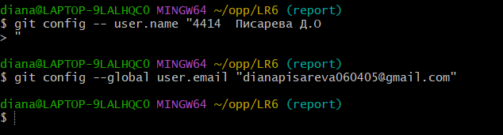


2. Клонирование репозитория
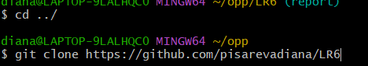


3. Добавила файл через интерфейс Github
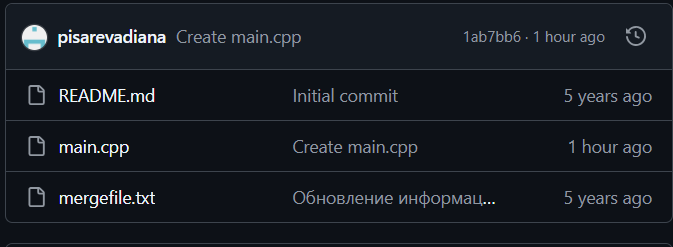

4. Подтягиваю изменения
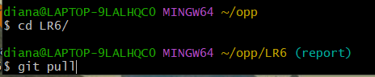

5. Получаем историю коммитов
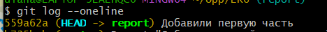

6. Смотрим последние изменения 
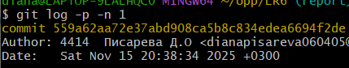

7. Создаю ветку feature-branch
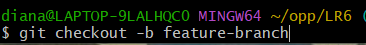

8. Изменяю наполнение 
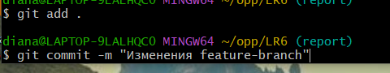

9. Перехожу в ветку master
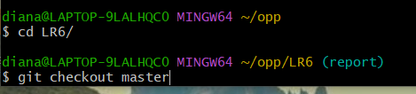

10. Выполняю слияние
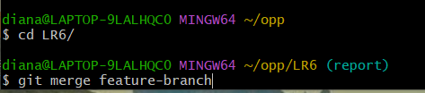

11. Удаляю ветку
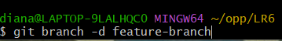

12. Обновила код, сделал коммит


13. Отменяю последний коммит
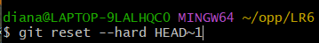

14. Перехожу в новую ветку для выгрузки README.md
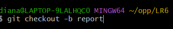

15. Достала историю

```bash
git log --pretty=format:"%h %ad | %s%d [%an]" --date=short
```

## git log

```text

84b33d5 2025-11-15 | Добавила еще несколько пунктов (HEAD -> report) [4414  Писарева Д.О]
10f717c 2025-11-15 | Добавили еще 7 пунктов [4414  Писарева Д.О]
559a62a 2025-11-15 | Добавили первую часть [4414  Писарева Д.О]
b735bcb 2025-11-15 | Revert "Добавлен второй комментарий" (master) [4414 Писарева Д.О.]
6a7a1e5 2025-11-15 | Добавлен второй комментарий [4414 Писарева Д.О.]
8863ccb 2025-11-15 | Добавлен комментарий [4414 Писарева Д.О.]
4520249 2025-11-15 | Изменения в начале цикла [4414 Писарева Д.О.]
1ab7bb6 2025-11-15 | Create main.cpp (origin/master, origin/HEAD) [pisarevadiana]
921f53b 2020-11-21 | Обновление информации [Kurtyanik]
c08a654 2020-11-21 | Файл создан пустым [Kurtyanik]
3c6e913 2020-11-21 | Initial commit [Kurtyanik]

```
